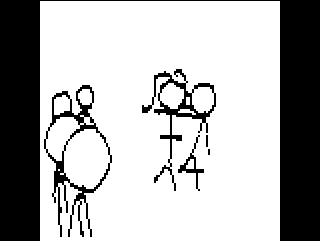
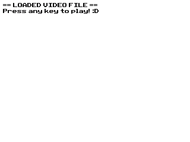

# 84VID/VID84 Video Codec for TI-84 Plus CE Systems



84VID/VID84 (interchangeable) is a simple and fast codec designed for video playback on TI-84 Plus CE calculators. Public Domain. It is notably non-conventional, the encoder "rasterizing" standard compressed images into Greedy Meshed arrays of rectangles, and using those as the data storage medium.

This repository contains both an encoder and decoder, along with instructions on how to use and set up both.

## Features
- 240x240 Resolution Canvas with Integer Down-Scaling.
- Supporting Custom FPS/Refresh Rates up to 63Hz (soft limit).
- Black-On-White (No color, no grayscale).

## Encoding Videos as VID84/84VID
The encoder is a Python 3 script, and is located in the `encoder` directory of the repository.

The following modules are required to run the encoder:
```
colorama==0.4.6
numpy==1.24.3
opencv-python==4.7.0.72
```
They can be installed automatically with `pip -r requirements.txt`.

`84vid_encoder.py --help` will give you a list of arguments to use to encode your videos. To encode the provided sample, you can just run `8rvid_encoder.py -i sample.mp4 -f 12`. It will generate a `video.bin` file if all goes well.

## Decoding Videos/Playback
Binaries need to be built with the video data built-in in order to play them back. In order to build these binaries, the [CE-Programming Toolchain](https://github.com/CE-Programming/toolchain) is required. Your device will also need the [C Libraries](tiny.cc/clibs) installed to launch these binaries. You will also need access to the `xxd` command, which is provided in most standard unix environments.

`xxd -i <your_video.bin_equivalent> > some_output.txt` will generate a raw text file with a C-style array and length declaration. You can paste it inside of a header, ideally formatted like this:

```c
#ifdef _VID84_H_
#error There is already an 84VID header included in the build.
#endif

#ifndef _VID84_H_
#define _VID84_H_

unsigned char video_bin[] = {
// Your video.bin data
};
unsigned int video_bin_len = 999;


#endif // _VID84_H_
```

With your header file set, you can navigate to the `decoder` directory and paste it into `src/` with `main.c`. You can see we already provide you with a header for the sample video (`sample.h`).

In `main.c`, you will need to swap out header `#include`s for whichever video you want to compile with. You can not have multiple headers included, the compiler will yell at you for this.

Finally, `make` will generate `.8xp` and var extensions (if applicable) in the `bin` directory. If your video file was too big, the compiler may refuse to generate these binaries. Additionally, depending on how much RAM and ROM available on your device, you may be unable to load a successfully built binary.

Copying the binary over with [tilp](https://aur.archlinux.org/packages/tilp) (Linux) or [TI-Connect]() (Windows/macOS) will allow you to launch the program, and the interface will guide you through playback.



## Specification Details
Refer to [main.c](decoder/src/main.c)'s comment header on the VID84/84VID file specification.